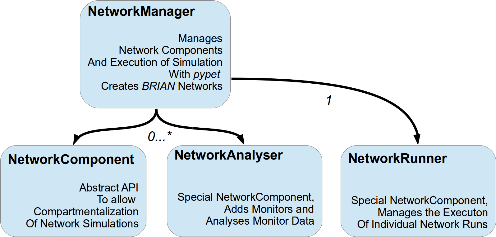
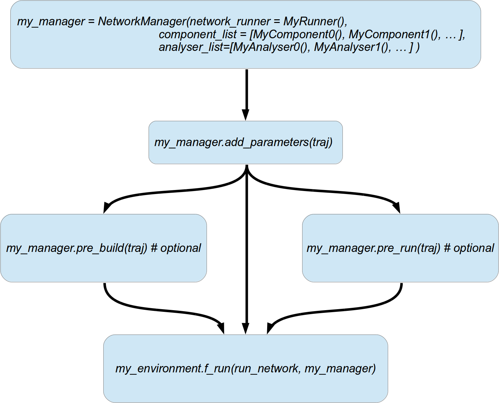
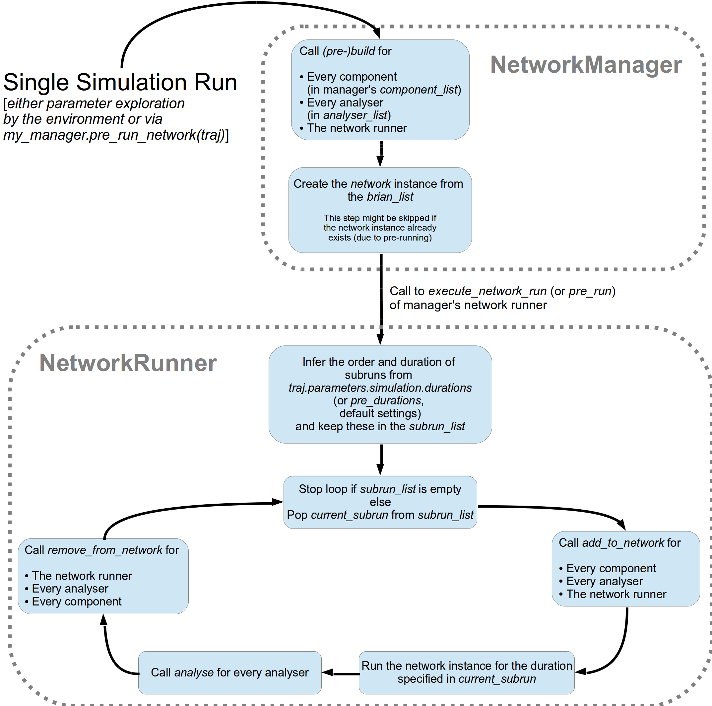

.. _brian-framework:

======================
Using BRIAN with pypet
======================

-------------------
IMPORTANT
-------------------

Although the general *pypet* API is supposed to remain stable, this promise excludes the BRIAN
part. The *pypet* BRIAN subpackage is still considered to be **alpha**. I probably won't
change too much within the ``pypet.brian.parameter`` module, but expect the ``pypet.brian.network``
module to undergo many changes and updates. Furthermore, the *pypet.brian* package has only been
used with BRIAN **1.X**, no guarantee for BRIAN 2.

-----------------
pypet and BRIAN
-----------------

BRIAN_ as it comes is nice for small scripts and quick simulations, but it can
be really hard to manage and maintain large scale projects based on
very complicated networks with many parts and components.
So I wrote a *pypet* extension that allows easier handling of more sophisticated
BRIAN_ networks.

All of this can be found in ``pypet.brian`` sub-package.
The package contains a ``parameter.py`` file that includes specialized containers
for BRIAN_ data, like the :class:`~pypet.brian.parameter.BrianParameter`,
the :class:`~pypet.brian.parameter.BrianResult` (both for BRIAN Quantities), and
the :class:`~pypet.brian.parameter.BrianMonitorResult` (extracts data from any kind of
BRIAN Monitor_).

These can be used
in conjunction with the network management system in the ``network.py`` file within
the ``pypet.brian`` package.

In the following I want to explain how to use the ``network.py`` framework to run large
scale simulations. An example of such a large scale simulation can be found in
:ref:`example-11` which is an implementation of the `Litwin-Kumar and Doiron paper`_
from 2012.

----------------------------
The BRIAN network framework
----------------------------

The core idea behind my framework is that simulated spiking neural network are
not in one giant piece but compartmentalize. Networks consist of NeuronGroups_,
Connections_ or Synapses_, Monitors_ and so on and so forth. Thus, it would be neat
if these parts can be easily replaced or augmented without rewriting a whole
simulation. You want to add STDP to your network? Just plug-in an STDP component.
You do not want to record anymore from the inhibitory neurons? Just throw away a
recording component.

To abstract this idea, the whole simulation framework evolves around the
:class:`~pypet.brian.network.NetworkComponent` class. This specifies an abstract API
that any component (which you as a user implement) should agree on to make them easy
to replace and communicate with each other.

There are two specialisation of this :class:`~pypet.brian.network.NetworkComponent` API:
The :class:`~pypet.brian.network.NetworkAnalyser` and
the :class:`~pypet.brian.network.NetworkRunner`. Implementations of the former deal with
the analysis of network output. This might range from simply adding and removing Monitors_ to
evaluating the monitor data and computing statistics about the network activity.
An instance of the latter is usually only created once and takes care about the running
of a network simulation.

All these three types of components are managed by the
:class:`~pypet.brian.network.NetworkManager` that also creates `BRIAN networks`_ and
passes these to the runner.
Conceptually this is depicted in figure below.

-------------------
Main Script
-------------------

In your main script that you use to create an environment and start the parameter exploration,
you also need to include these following steps.

    *  Create a :class:`~pypet.brian.network.NetworkRunner` and your
        :class:`~pypet.brian.network.NetworkComponent` instances and
        :class:`~pypet.brian.network.NetworkAnalyser` instances defining
        the layout and structure of your network and simulation.

        What components are and how to implement these will be discussed in the
        next section.

    * Create a :class:`~pypet.brian.network.NetworkManager`:

        Pass your :class:`~pypet.brian.network.NetworkRunner` (as first argument `network_runner`),
        all your :class:`~pypet.brian.network.NetworkComponent` instances as a list
        (as second argument ``component_list``) and all :class:`~pypet.brian.network.NetworkAnalyser`
        instances (as third argument ``analyser_list``) to the constructor of the manager.

        Be aware that the order of components and analysers matter. The building of components,
        addition, removal, and analysis (for analyser) is executed in the order they are
        passed in the ``component_list`` and ``analyser_list``, respectively.
        If a component *B* depends on *A* and *C*, make *B* appear after *A* and *C*
        in the list.

        For instance, you have an excitatory neuron group, an inhibitory one, and a connection
        between the two. Accordingly, your :class:`~pypet.brian.network.NetworkComponent`
        creating the connection must be listed after the components responsible for
        creating the neuron groups.

        For now on let's call the network manager instance ``my_manager``.

    * Call ``my_manager.add_parameters(traj)``:

        This automatically calls ``add_parameters(traj)`` for all components, all analysers
        and the runner. So that they can add all their necessary parameters to the
        the trajectory ``traj``.

    * *(Optionally)* call ``my_manager.pre_build(traj)``:

        This will automatically trigger the ``pre_build`` function of your components,
        analysers and the network runner.

        This is useful if you have some components that do not change during parameter
        exploration, but which are costly to create and can be so in advance.

        For example, you might have different neuron layers in your network and parts of the
        network do not change during the runtime of your simulation. For instance,
        your connections from an LGN neuron group to a V1 neuron group is fixed.
        Yet, the computation of the connection pattern is costly, so you can do this
        in ``pre_build`` to save some time instead of building these over and over again in
        every single run.

    * *(Optionally)* call ``my_manager.pre_run_network(traj)``

        This will trigger a *pre run* of the network.
        First ``my_manager.pre_build`` is called (so you do not have to call it yourself
        if you intend a *pre run*). Then a novel `BRIAN network`_ instance is created from
        the ``brian_list`` (see below). This network is simulated by your runner.
        The state after the *pre run*
        is preserved for all coming simulation runs during parameter exploration.

        This is useful if your parameter exploration does not involve modifications of the
        network per se. For instance, you explore different input stimuli which are
        tested on the very same network. Moreover, you have the very same initialisation run
        for every stimulus experiment. Instead of re-simulating the init run over and over again
        for every stimulus, you can perform it once as a *pre run* and use the network after
        the *pre run* for every stimulus input.

    *   Pass the :func:`~pypet.brian.network.NetworkManger.run_network` to
        your environment's :func:`~pypet.environment.f_run` to start parameter exploration.
        This will automatically initiate the ``build(traj)`` method for all your components,
        analysers and your runner in every single run. Subsequently, your network will be
        simulated with he help of your network runner.

These steps are also depicted in the figure below.

An example *main script* might look like the following:

.. code-block:: python

    env = Environment(trajectory='Clustered_Network',
                  filename='experiments/example_11/HDF5/',
                  log_folder='experiments/example_11/LOGS/',
                  continuable=False,
                  multiproc=True,
                  ncores=2,
                  use_pool=False)

    #Get the trajectory container
    traj = env.v_trajectory

    # We create a Manager and pass all our components to the Manager.
    # Note the order, MyNeuronGroupsComponent are scheduled before MyConnectionsComponent,
    # and the Fano Factor computation depends on the MyMonitorAnalysisComponent
    my_manager = NetworkManager(network_runner=MyNetworkRunner(),
                     component_list=(MyNeuronGroupsComponent(), MyConnectionsComponent()),
                     analyser_list=(MyMonitorAnalysisComponent(), MyFanoFactorComputingComponent()))

    # Add parameters
    my_manager.add_parameters(traj)

    # Explore different values of a parameter
    explore_list = np.arange(0.0, 42.0, 0.5).tolist()
    traj.f_explore({'some.random.parameter.of.my.network' : explore_list})

    # Pre-build network components
    my_manager.pre_build(traj)

    # Run the network simulation
    env.f_run(my_manager.run_network)

^^^^^^^^^^^^^^^^^^^^^^^^^^^^^^^^^^^^^^^^^
Multiprocessing and Iterative Processing
^^^^^^^^^^^^^^^^^^^^^^^^^^^^^^^^^^^^^^^^^

The framework is especially designed to allow for multiprocessing and to
distribute parameter exploration of network simulations onto several cpus.
Even if parts of your network cannot be pickled, multiprocessing
can be easily achieved by setting ``use_pool=False`` for your
:class:`~pypet.environment.Environment`.

Yet, single core processing is more subtle. In fact if you want to
``pre_build`` parts of your network or even *pre run* a whole network,
you can no longer use iterative computation of the single runs of your parameter
exploration. The reason for this lies in the deep inner parts of BRIAN.
The problem is that `BRIAN networks`_ are not well encapsulated objects,
but are strongly dependent on the whole BRIAN runtime environment.
As a consequence, you cannot take *snapshots* of a network in order
to *rerun* a given network. In case of parameter exploration, a
`BRIAN network`_ changes after each single run. The starting condition of
the second run are the network state after (!) the first run and not before
the first run. The only solution to this problem is to not only copy
the `BRIAN network`_ but also the whole BRIAN runtime environment.
The straightforward way to do this is simply to fork a new process.
This is the reason why you cannot run single core processing on
*pre-built* networks.

If you want to come close to single core processing use ``multiproc=True``
and ``ncores=1`` with your environment.
If you really do not care about messed up initial conditions
- maybe since you just debug your code - you can enforce true single core
processing by passing ``force_single_core=True`` when you create your
:class:`~pypet.brian.network.NetworkManager`.

Next, I'll go a bit more into detail about components and finally you
will learn which steps are involved in a network simulation.

------------------------
Network Components
------------------------

Network components are the basic building blocks of a *pypet* BRIAN experiment.
There exist three types:

    1. Ordinary :class:`~pypet.brian.network.NetworkComponent`

    2. :class:`~pypet.brian.network.NetworkAnalyser` for data analysis and recording

    3. :class:`~pypet.brian.network.NetworkRunner` for simulation execution.

And these are written by YOU (eventually except for the network runner).
The classes above are only abstract and define the API that can be implemented
to make *pypet*'s BRIAN framework do its job.

By subclassing these, you define components that build and create BRIAN_ objects. For example,
you could have your own `ExcNeuronGroupComponent` that creates a NeuronGroup_ of
excitatory neurons. Your `ExcNeuronSynapsesComponent` creates BRIAN Synapses_ to
make recurrent connections within the excitatory neuron group.
These brian objects (NeuronGroup_ and Synapses_) are then taken by the
network manager to construct a `BRIAN network`_.

Every component can implement these 5 methods:

    * :func:`~pypet.brian.network.NetworkComponent.add_parameters`:

        This function should only add parameters necessary for your component
        to your trajectory ``traj``.

    *   :func:`~pypet.brian.network.NetworkComponent.pre_build` and/or
        :func:`~pypet.brian.network.NetworkComponent.build`

        Both are very similar and should trigger the construction of objects
        relevant to BRIAN_ like NeuronGroups_ or Connections_.
        However, they differ in when they are executed.
        The former is initiated either by you directly (aka ``my_manger.pre_build(traj)``), or
        by a *pre run* (``my_manager.pre_run_network(traj)``).
        The latter is called during your single runs for parameter exploration,
        before the `BRIAN network`_ is simulated by your runner.

        The two methods provide the following arguments:

        - ``traj``

            Trajectory container, you can gather all parameters you need from here.

        - ``brian_list``

            A non-nested (!) list of objects relevant to BRIAN_.

            Your component has to add BRIAN_ objects to this list if these
            objects should be added to the `BRIAN network`_ at network creation.
            Your manager will create a `BRIAN network`_ via ``Network(*brian_list)``.

        - ``network_dict``

            Add any item to this dictionary that should be shared or accessed by all
            your components and which are not part of the trajectory container.
            It is recommended to also put all items from the ``brian_list`` into
            the dictionary for completeness.

        For convenience I suggest documenting the implementation of ``build`` and
        ``pre-build`` and the other component methods in your subclass like the following.
        Use statements like *Adds* for items that are added to the list and dictionary and
        *Expects* for what is needed to be part of the ``network_dict`` in order to build the
        current component.

        For instance:

            brian_list:

                Adds:

                4 Connections, between all types of neurons (e->e, e->i, i->e, i->i)

            network_dict:

                Expects:

                'neurons_i': Inhibitory neuron group

                'neurons_e': Excitatory neuron group

                Adds:

                'connections' : List of 4 Connections,
                                between all types of neurons (e->e, e->i, i->e, i->i)

    * :func:`~pypet.brian.network.NetworkComponent.add_to_network`:

        This method is called shortly before a *subrun* of your simulation (see below).

        Maybe you did not want to add a BRIAN_ object directly to the ``network`` on
        its creation, but sometime later. Here you have the chance to do that.

        For instance, you have a SpikeMonitor_ that should not record
        the initial first *subrun* but the second one.
        Accordingly, you did not pass it to the ``brian_list`` in
        :func:`~pypet.brian.network.NetworkComponent.pre_build` or
        :func:`~pypet.brian.network.NetworkComponent.build`.
        You can now add your monitor to the ``network`` via its ``add`` functionality, see
        the the `BRIAN network`_ class.

        The :func:`~pypet.brian.network.NetworkComponent.add_to_network` relies on
        the following arguments

        - ``traj``

            Trajectoy container

        - ``network``

            `BRIAN network`_ created by your manager. Elements can be added via `add(...)`.

        - ``current_subrun``

            :class:`~pypet.brian.parameter.BrianParameter` specifying the very next
            *subrun* to be simulated. See next section for *subruns*.

        - ``subrun_list``

            List of :class:`~pypet.brian.parameter.BrianParameter` objects that are to
            be simulated after the current *subrun*.

        - ``network_dict``

            Dictionary of items shared by all components.

    * :func:`~pypet.brian.network.NetworkComponent.remove_from_network`

        This method is analogous to :func:`~pypet.brian.network.NetworkComponent.add_to_network`.
        It is called after a *subrun* (and after analysis, see below), and gives you the chance
        to remove items from a network.

        For instance, you might want to remove a particular BRIAN Monitor_ to skip
        recording of coming *subruns*.

Be aware that these functions **can** be implemented, but they do not have to be.
If your custom component misses one of these, there is **no** error thrown. Instead, simply
`pass` is executed (see the source code!).

^^^^^^^^^^^^^^^^^
NetworkAnalyser
^^^^^^^^^^^^^^^^^

The :class:`~pypet.brian.network.NetworkAnalyser` is a subclass of an ordinary component.
It augments the component API by the function
:func:`~pypet.brian.network.NetworkAnalyser.analyse`.
The very same parameters as for :func:`~pypet.brian.network.NetworkComponent.add_to_network` are
passed to the analyse function. As the name suggests, you can run some analysis here.
This might involve extracting data from monitors or computing statistics like Fano Factors, etc.

^^^^^^^^^^^^^^^^
NetworkRunner
^^^^^^^^^^^^^^^^

The :class:`~pypet.brian.network.NetworkRunner` is another subclass of an ordinary component.
The given :class:`~pypet.brian.network.NetworkRunner` does not define an API but
provides functionality to execute a network experiment.
There's no need for creating your own subclass. Yet, I still suggest subclassing the
:class:`~pypet.brian.network.NetworkRunner`, but just implement the
:func:`~pypet.brian.network.NetworkComponent.add_parameters` method. There you can add
:class:`~pypet.brian.parameter.BrianParameter` instances to your trajectory
to define how long a network simulation lasts and in how many *subruns* it is divided.

-----------------------------
A Simulation Run and Subruns
-----------------------------

A single run of a network simulation is further subdivided into so called *subruns*.
This holds for a *pre run* triggered by ``my_manager.pre_run_network(traj)`` as well
as an actual single run during parameter exploration.

The subdivision of a single run into further *subruns* is necessary to allow having
different phases of a simulation. For instance, you might want to run your network
for an initial phase (subrun) of 500 milliseconds. Then one of your analyser components checks for
pathological activity like too high firing rates. If this activity is detected, you
cancel all further subruns and skip the rest of the single run. You can do this by simply
removing all *subruns* from the ``subrun_list``. You could also add further
:class:`~pypet.brian.parameter.BrianParameter` instances to the list to make your
simulations last longer.

The ``subrun_list`` (as it is passed to :func:`~pypet.brian.network.NetworkComponent.add_to_network`,
:func:`~pypet.brian.network.NetworkComponent.remove_from_network`, or
:func:`~pypet.brian.network.NetworkAnalyser.analyse`) is populated by your network runner
at the beginning of every single run (or *pre-run*) in your parameter exploration.
The network runner searches for :class:`~pypet.brian.parameter.BrianParameter` instances
in a specific group in your trajectory. By default this group is
`traj.parameters.simulation.durations`
(or `traj.parameters.simulation.pre_durations` for a *pre-run*),
but you can pick another group name when you create a :class:`~pypet.brian.network.NetworkRunner`
instance. The order of the subruns is inferred from the ``v_annotations.order`` attribute of
the :class:`~pypet.brian.parameter.BrianParameter` instances. The subruns are
executed in increasing order. The orders do not need to be consecutive, but a RuntimeError
is thrown in case two subruns have the same order. There is also an Error raised if there exists a
parameter where ``order`` cannot be found in it's ``v_annotations`` property.

In previous versions of *pypet.brian* there was a so called ``BrianDurationParameter`` that
possessed a special attribute ``v_order``. This was basically a normal
:class:`~pypet.brian.parameter.BrianParameter` with a little bit of overhead. Thus,
the ``BrianDurationParameter`` became a victim of refactoring. There is still an implementation
left for backwards-compatibility. Please, do *NOT* use the old ``BrianDurationParameter``,
but a normal :class:`~pypet.brian.parameter.BrianParameter` and replace calls to
``v_order`` with ``v_annotations.order``.

For instance, in ``traj.parameter.simulation.durations`` there are three
:class:`~pypet.brian.parameter.BrianParameter` instances.

    >>> init_run = traj.parameter.simulation.durations.f_add_parameter('init_run', 500 * ms)
    >>> init_run.v_annotations.order=0
    >>> third_run = traj.parameter.simulation.durations.f_add_parameter('third_run', 1.25 * second)
    >>> third_run.v_annotations.order=42
    >>> measurement_run = traj.parameter.simulation.durations.f_add_parameter('measurement_run', 15 * second)
    >>> measurement_run.v_annotations.order=1

One is called `init_run`, has ``v_annotations.order=0`` and lasts 500 milliseconds
(this is not cpu runtime but BRIAN simulation time).
Another one is called `third_run` lasts 1.25 seconds and has order 42.
The third one is named `measurement_run` lasts 5 seconds and has order 1.
Thus, a single run involves three *subruns*. They are executed in the order:
`init_run` involving running the network for
0.5 seconds, `measurement_run` for 5 seconds, and finally `third_run` for 1.25 seconds,
because 0 < 1 < 42.

The ``current_subrun`` :class:`~pypet.brian.parameter.BrianParameter`
is taken from the ``subrun_list``.
In every subrun the :class:`~pypet.brian.network.NetworkRunner` will call

    1. :func:`~pypet.brian.network.NetworkComponent.add_to_network`

        * for all ordinary components

        * for all analysers

        * for the network runner itself

    2. ``run(duration)`` from the `BRIAN network`_ created by the manager.

        Where the ``duration`` is simply the data handled by the ``current_subrun``
        which is a :class:`~pypet.brian.parameter.BrianParameter`.

    3. :func:`~pypet.brian.network.NetworkAnalyser.analyse` for all analysers

    4. :func:`~pypet.brian.network.NetworkComponent.remove_from_network`

        * for the network runner itself

        * for all analysers

        * for all ordinary components

The workflow of network simulation run is also depicted in the figure below.

I recommend taking a look at the source code in the ``pypet.brian.network`` python file
for a better understanding how the *pypet* BRIAN framework can be used.
Especially, check the :func:`~pypet.brian.network.NetworkRunner._execute_network_run`
method that performs the steps mentioned above.

Finally, despite the risk to repeat myself too much,
there is an example on how to use *pypet* with BRIAN based on the
paper by `Litwin-Kumar and Doiron paper`_ from 2012, see :ref:`example-11`.

Cheers,

    Robert

.. _BRIAN: http://briansimulator.org/

.. _`Litwin-Kumar and Doiron paper`: http://www.nature.com/neuro/journal/v15/n11/full/nn.3220.html

.. _NeuronGroups: http://briansimulator.org/docs/reference-models-and-groups.html

.. _NeuronGroup: http://briansimulator.org/docs/reference-models-and-groups.html

.. _Connections: http://briansimulator.org/docs/reference-connections.html

.. _Synapses: http://briansimulator.org/docs/reference-synapses.html

.. _Monitors: http://briansimulator.org/docs/reference-monitors.html

.. _Monitor: http://briansimulator.org/docs/reference-monitors.html

.. _`BRIAN networks`: http://briansimulator.org/docs/reference-network.html#brian.Network

.. _`BRIAN network`: http://briansimulator.org/docs/reference-network.html#brian.Network

.. _SpikeMonitor: http://briansimulator.org/docs/reference-monitors.html#brian.SpikeMonitor