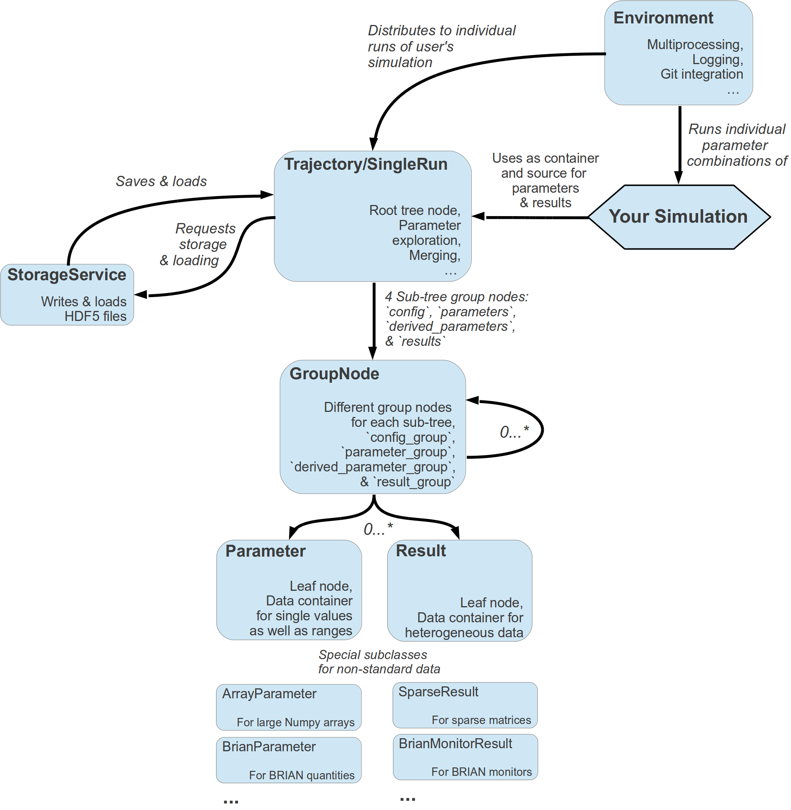

==========================
What is *pypet* all about?
==========================

Whenever you do numerical simulations in science you come across two major problems:
First, you need some way to save your data. Secondly, you extensively explore the parameter space.
In order to accomplish both you write some hacky I/O functionality to get it done the quick and
dirty way. Storing stuff into text files, as *MATLAB* *m*-files, or whatever comes in handy.

After a while and many simulations later, you want to look back at some of your very
first results. But because of unforeseen circumstances, you changed lots of your code.
As a consequence, you can no longer use your old data, but you need to write a hacky
converter to format your previous results to your new needs.
The more complexity you add to your simulations, the worse it gets, and you spend way
too much time formatting your data than doing science.

Indeed, this was a situation I was confronted with pretty soon at the beginning of my PhD.
So this project was born. I wanted to tackle the I/O problems more generally and produce code
that was not specific to my current simulations, but I could also use for future scientific
projects right out of the box.

The **python parameter exploration toolkit** (*pypet*) provides a framework to define *parameters*
that you need to run your simulations.
You can actively explore these by following a *trajectory* through the space spanned
by the parameters.
And finally, you can get your *results* together and store everything appropriately to disk.
The storage format of choice is HDF5_ via PyTables_.

-------------
Main Features
-------------

* **Novel tree container** `Trajectory`, for handling and managing of
  parameters and results of numerical simulations

* **Group** your parameters and results into meaningful categories

* Access data via **natural naming**, e.g. ``traj.parameters.traffic.ncars``

* Automatic **storage** of simulation data into HDF5_ files via PyTables_

* Support for many different **data formats**

    * python native data types: bool, int, long, float, str, complex

    * list, tuple, dict

    * Numpy arrays and matrices

    * Scipy sparse matrices

    * pandas_ Series, DataFrames, and Panels

    * BRIAN2_ quantities and monitors

* Easily **extendable** to other data formats!

* **Exploration** of the parameter space of your simulations

* **Merging** of *trajectories* residing in the same space

* Support for **multiprocessing**, *pypet* can run your simulations in parallel

* **Analyse** your data on-the-fly during multiprocessing

* **Adaptively** explore the parameter space combining *pypet* with optimization
  tools like the evolutionary algorithms framework DEAP_

* **Dynamic Loading**, load only the parts of your data you currently need

* **Resume** a crashed or halted simulation

* **Annotate** your parameters, results and groups

* **Git Integration**, let *pypet* make automatic commits of your codebase

* **Sumatra Integration**, let *pypet* add your simulations to the *electronic lab notebook* tool
  Sumatra_

* *pypet* can be used on **computing clusters** or multiple servers at once if it is combined with
  the `SCOOP framework`_

===============
Getting Started
===============

------------
Requirements
------------

3.7 or higher [#pythonversion]_ and

* numpy_ >= 1.16.0

* scipy_ >= 1.0.0

* tables_ >= 3.5.0

* pandas_ >= 1.0.0

* HDF5_ >= 1.10.0

Python 2.6 and 2.7 are no longer supported. Still if you
need *pypet* for these versions check out the legacy `0.3.0`_ package.

^^^^^^^^^^^^^^^^^
Optional Packages
^^^^^^^^^^^^^^^^^

If you want to combine *pypet* with the `SCOOP framework`_ you need

* scoop_ >= 0.7.1

For git integration you additionally need

* GitPython_ >= 3.1.3

To utilize the cap feature for :ref:`more-on-multiprocessing` you need

* psutil_ >= 5.7.0

To utilize the continuing of crashed trajectories you need

* dill_ >= 0.3.1

Automatic sumatra records are supported for

* Sumatra_ >= 0.7.1

.. rubric:: Footnotes

.. [#pythonversion]

    *pypet* might also work under Python 3.0-3.6 but has not been tested.

-------
Install
-------

If you don't have all prerequisites (numpy_, scipy_, tables_, pandas_) install them first.
These are standard python packages, so chances are high that they are already installed.
By the way, in case you use the python package manager ``pip``
you can list all installed packages with ``pip freeze``.

Next, simply install *pypet* via ``pip install pypet``

**Or**

The package release can also be found on `pypi.python.org`_. Download, unpack
and ``python setup.py install`` it.

**Or**

In case you use **Windows**, you have to download the tar file from `pypi.python.org`_ and
unzip it [#tar]_. Next, open a windows terminal [#win]_
and navigate to your unpacked *pypet* files to the folder containing the `setup.py` file.
As above, run from the terminal ``python setup.py install``.

.. _`pypi.python.org`: https://pypi.python.org/pypi/pypet

.. [#tar]

    Extract using WinRaR, 7zip, etc. You might need to unpack it twice, first
    the `tar.gz` file and then the remaining `tar` file in the subfolder.

.. [#Win]

    In case you forgot how, you open a terminal by pressing *Windows Button* + *R*.
    Then type *cmd* into the dialog box and press *OK*.

^^^^^^^
Support
^^^^^^^

Checkout the `pypet Google Group`_.

To report bugs please use the issue functionality on **github**
(https://github.com/SmokinCaterpillar/pypet).

.. _`pypet Google Group`: https://groups.google.com/forum/?hl=de#!forum/pypet

------------------------
What to do with *pypet*?
------------------------

The whole project evolves around a novel container object called *trajectory*.
A *trajectory* is a container for *parameters* and *results* of numerical simulations
in python. In fact a *trajectory* instantiates a tree and the
tree structure will be mapped one to one in the HDF5 file when you store data to disk.
But more on that later.

As said before a *trajectory* contains *parameters*, the basic building blocks that
completely define the initial conditions of your numerical simulations. Usually, these are
very basic data types, like integers, floats or maybe a bit more complex numpy arrays.

For example, you have written a set functions that simulates traffic
jam in Rome. Your simulation takes a lot of *parameters*, the amount of
cars (integer), their potential destinations (numpy array of strings),
number of pedestrians (integer),
random number generator seeds (numpy integer array), open parking spots in Rome
(your *parameter* value is probably 0 here), and all other sorts of things.
These values are added to your *trajectory* container and can be retrieved from there
during the runtime of your simulation.

Doing numerical simulations usually means that you cannot find analytical solutions to your
problems. Accordingly, you want to evaluate your simulations on very different *parameter* settings
and investigate the effect of changing the *parameters*. To phrase that differently, you want to
*explore* the parameter space. Coming back to the traffic jam simulations, you could tell your
*trajectory* that you want to investigate how different amounts of cars and pedestrians
influence traffic problems in Rome. So you define sets of combinations of cars and pedestrians
and make individual simulation *runs* for these sets. To phrase that differently,
you follow a predefined *trajectory* of points through your *parameter* space and evaluate their
outcome. And that's why the container is called *trajectory*.

For each *run* of your simulation, with a particular combination of cars and pedestrians, you
record time series data of traffic densities at major sites in Rome. This time series data
(let's say they are pandas_ DataFrames) can also be added to your *trajectory* container.
In the end everything will be stored to disk. The storage is handled by an
extra service to store the *trajectory* into an
HDF5_ file on your hard drive. Probably other formats like SQL might be implemented
in the future
(or maybe **you** want to contribute some code and write an SQL storage service?).

---------------
Basic Work Flow
---------------

Basic workflow is summarized in the image you can find below.
Usually you use an :class:`~pypet.environment.Environment` for handling the execution and running
of your simulation.
As in the example code snippet in the next subsection, the environment will provide a
:class:`~pypet.trajectory.Trajectory` container for you to fill in your parameters.
During the execution of your simulation with individual parameter combinations,
the *trajectory* can also be used to store results.
All data that you hand over to a *trajectory* is automatically
stored into an HDF5 file by the :class:`~pypet.storageservice.HDF5StorageService`.

---------------------
Quick Working Example
---------------------

The best way to show how stuff works is by giving examples. I will start right away with a
very simple code snippet (it can also be found here: :ref:`example-01`).

Well, what we have in mind is some sort of numerical simulation. For now we will keep it simple,
let's say we need to simulate the multiplication of 2 values, i.e. :math:`z=x*y`.
We have two objectives, a) we want to store results of this simulation :math:`z` and
b) we want to *explore* the parameter space and try different values of :math:`x` and :math:`y`.

Let's take a look at the snippet at once:

.. code-block:: python

    from pypet import Environment, cartesian_product

    def multiply(traj):
        """Example of a sophisticated simulation that involves multiplying two values.

        :param traj:

            Trajectory containing
            the parameters in a particular combination,
            it also serves as a container for results.

        """
        z = traj.x * traj.y
        traj.f_add_result('z',z, comment='I am the product of two values!')

    # Create an environment that handles running our simulation
    env = Environment(trajectory='Multiplication',filename='./HDF/example_01.hdf5',
                      file_title='Example_01',
                      comment='I am a simple example!',
                      large_overview_tables=True)

    # Get the trajectory from the environment
    traj = env.trajectory

    # Add both parameters
    traj.f_add_parameter('x', 1.0, comment='Im the first dimension!')
    traj.f_add_parameter('y', 1.0, comment='Im the second dimension!')

    # Explore the parameters with a cartesian product
    traj.f_explore(cartesian_product({'x':[1.0,2.0,3.0,4.0], 'y':[6.0,7.0,8.0]}))

    # Run the simulation with all parameter combinations
    env.run(multiply)

    # Finally disable logging and close all log-files
    env.disable_logging()

And now let's go through it one by one. At first, we have a job to do, that is multiplying
two values:

.. code-block:: python

    def multiply(traj):
        """Example of a sophisticated simulation that involves multiplying two values.

        :param traj:

            Trajectory containing
            the parameters in a particular combination,
            it also serves as a container for results.

        """
        z=traj.x * traj.y
        traj.f_add_result('z',z, comment='I am the product of two values!')

This is our simulation function ``multiply``. The function makes use of a
:class:`~pypet.trajectory.Trajectory` container which manages our parameters.
Here the *trajectory* holds a particular parameter space point, i.e. a particular
choice of :math:`x` and :math:`y`. In general a *trajectory* contains many parameter settings,
i.e. choices of points sampled from the parameter space. Thus, by sampling points from
the space one follows a trajectory through the parameter space -
therefore the name of the container.

We can access the parameters simply by natural naming,
as seen above via ``traj.x`` and ``traj.y``. The value of `z` is simply added as a result to the
``traj`` container.

After the definition of the job that we want to simulate, we create an *environment* which
will run the simulation. Moreover, the environment will take
care that the function ``multiply`` is called with each choice of parameters once.

.. code-block:: python

    # Create an environment that handles running our simulation
    env = Environment(trajectory='Multiplication',filename='./HDF/example_01.hdf5',
                      file_title='Example_01',
                      comment = 'I am a simple example!',
                      large_overview_tables=True)

We pass some arguments here to the constructor. This is the name of the new trajectory,
a filename to store the trajectory into, the title of the file, and a
descriptive comment that is attached to the trajectory. We also set
``large_overview_tables=True`` to get a nice summary of all our computed :math:`z` values
in a single table. This is disabled by default to yield smaller and more compact HDF5 files.
But for smaller projects with only a few results, you can enable it without
wasting much space.
You can pass many more (or less) arguments
if you like, check out :ref:`more-on-environment` and :class:`~pypet.environment.Environment`
for a complete list.
The environment will automatically generate a trajectory for us which we can access via
the property ``trajectory``.

.. code-block:: python

    # Get the trajectory from the environment
    traj = env.trajectory

Now we need to populate our trajectory with our parameters. They are added with the default values
of :math:`x=y=1.0`.

.. code-block:: python

    # Add both parameters
    traj.f_add_parameter('x', 1.0, comment='Im the first dimension!')
    traj.f_add_parameter('y', 1.0, comment='Im the second dimension!')

Well, calculating :math:`1.0 * 1.0` is quite boring, we want to figure out more products. Let's
find the results of the cartesian product set :math:`\{1.0, 2.0, 3.0, 4.0\} \times \{6.0, 7.0, 8.0\}`.
Therefore, we use :func:`~pypet.trajectory.Trajectory.f_explore` in combination with the builder
function :func:`~pypet.utils.explore.cartesian_product` that yields the cartesian product of both
parameter ranges. You don't have to explore a cartesian product all the time. You can
explore arbitrary trajectories through your space. You only need to pass
a dictionary of lists (or other iterables) of the same length with arbitrary entries to
:func:`~pypet.trajectory.Trajectory.f_explore`. In fact,
:func:`~pypet.utils.explore.cartesian_product` turns the dictionary
`{'x':[1.0,2.0,3.0,4.0], 'y':[6.0,7.0,8.0]}` into a new one where the values of 'x' and 'y'
are two lists of length 12 containing all pairings of points.

.. code-block:: python

    # Explore the parameters with a cartesian product:
    traj.f_explore(cartesian_product({'x':[1.0,2.0,3.0,4.0], 'y':[6.0,7.0,8.0]}))

Finally, we need to tell the environment to run our job `multiply` with all parameter
combinations.

.. code-block:: python

    # Run the simulation with all parameter combinations
    env.run(multiply)

Usually, if you let *pypet* manage logging for you, it is a good idea in the end to tell
the environment to stop logging and close all log files.

.. code-block:: python

    # Finally disable logging and close all log-files
    env.disable_logging()

And that's it. The environment will evoke the function `multiply` now 12 times with
all parameter combinations. Every time it will pass a :class:`~pypet.trajectory.Trajectory`
container with another one of these 12 combinations of different :math:`x` and :math:`y` values
to calculate the value of :math:`z`.
And all of this is automatically stored to disk in HDF5 format.

If we now inspect the new HDF5 file in `examples/HDF/example_01.hdf5`,
we can find our *trajectory* containing all parameters and results.
Here you can see the summarizing overview table discussed above.

.. image:: /figures/example_01.png

^^^^^^^^^^^^
Loading Data
^^^^^^^^^^^^

We end this example by showing how we can reload the data that we have computed before.
Here we want to load all data at once, but as an example just print the result of `run_00000001`
where :math:`x` was 2.0 and :math:`y` was 6.0.
For loading of data we do not need an environment. Instead, we can construct an
empty trajectory container and load all data into it by ourselves.

.. code-block:: python

    from pypet import Trajectory

    # So, first let's create a new empty trajectory and pass it the path and name of the HDF5 file.
    traj = Trajectory(filename='experiments/example_01/HDF5/example_01.hdf5')

    # Now we want to load all stored data.
    traj.f_load(index=-1, load_parameters=2, load_results=2)

    # Finally we want to print a result of a particular run.
    # Let's take the second run named `run_00000001` (Note that counting starts at 0!).
    print('The result of run_00000001 is: ')
    print(traj.run_00000001.z)

This yields the statement *The result of run_00000001 is: 12* printed to the console.

Some final remarks on the command:

.. code-block:: python

    # Now we want to load all stored data.
    traj.f_load(index=-1, load_parameters=2, load_results=2)

Above ``index`` specifies that we want to load the trajectory with that particular index
within the HDF5 file. We could instead also specify a ``name``.
Counting works also backwards, so ``-1`` yields the last or newest trajectory in the file.

Next, we need to specify how the data is loaded.
Therefore, we have to set the keyword arguments ``load_parameters`` and ``load_results``.
Here we chose both to be ``2``.

``0`` would mean we do not want to load anything at all.
``1`` would mean we only want to load the empty hulls or skeletons of our parameters
or results. Accordingly, we would add parameters or results to our trajectory
but they would not contain any data.
Instead, ``2`` means we want to load the parameters and results including the data they contain.

------------------------------------------
Combining *pypet* with an Existing Project
------------------------------------------

Of course, you don't need to start from scratch. If you already have a rather sophisticated
simulation environment and simulator, there are ways to integrate or wrap *pypet* around
your project. You may want to look at :ref:`wrap-project` and
example :ref:`example-17` shows you how to do that.

So that's it for the start. If you want to know the nitty-gritty details of *pypet* take
a look at the :ref:`cookbook`. If you are not the type of guy who reads manuals but wants
hands-on experience, check out the :ref:`tutorial` or the :ref:`theexamples`.
If you consider using *pypet* with an already existing project of yours, I may
direct your attention to :ref:`example-17`.

Cheers,
    Robert

.. _tables: http://pytables.github.io/

.. _numpy: http://www.numpy.org/

.. _scipy: http://www.scipy.org/

.. _ordereddict: https://pypi.python.org/pypi/ordereddict

.. _GitPython: http://gitpython.readthedocs.org/en/stable/

.. _psutil: http://pythonhosted.org/psutil/

.. _pandas: http://pandas.pydata.org/

.. _BRIAN: http://briansimulator.org/

.. _BRIAN2: http://brian2.readthedocs.org/

.. _HDF5: http://www.hdfgroup.org/HDF5/

.. _PyTables: http://www.pytables.org/moin/PyTables

.. _Sumatra: http://neuralensemble.org/sumatra/

.. _dill: https://pypi.python.org/pypi/dill

.. _importlib: https://pypi.python.org/pypi/importlib/1.0.1

.. _unittest2: https://pypi.python.org/pypi/unittest2/1.0.1

.. _logutils: https://pypi.python.org/pypi/logutils

.. _SCOOP framework: http://scoop.readthedocs.org/

.. _scoop: https://pypi.python.org/pypi/scoop/

.. _DEAP: http://deap.readthedocs.org/en/

.. _0.3.0: https://pypi.python.org/pypi/pypet/0.3.0
