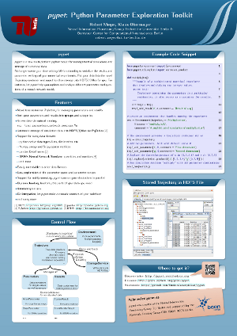

=======================
Publication Information
=======================

---------------
Citation Policy
---------------

If you use *pypet* in your research,
it would be very kind of you to cite this in your amazing work.
A research article about *pypet* is available at `frontiers`_, the
corresponding bibtex entry is:

::

    @article{Meyer2016,
        author={Meyer, Robert and Obermayer, Klaus},
        title={pypet: A Python Toolkit for Data Management of Parameter Explorations},
        journal={Frontiers in Neuroinformatics},
        volume={10},
        pages={38},
        year={2016},
        url={http://journal.frontiersin.org/article/10.3389/fninf.2016.00038},
        doi={10.3389/fninf.2016.00038},
        issn={1662-5196},
        abstract={pypet (Python parameter exploration toolkit) is a new
                  multi-platform Python toolkit for managing numerical simulations.
                  Sampling the space of model parameters is a key aspect of
                  simulations and numerical experiments. pypet is designed to
                  allow easy and arbitrary sampling of trajectories through a
                  parameter space beyond simple grid searches.
                  pypet collects and stores both simulation parameters and results
                  in a single HDF5 file.
                  This collective storage allows fast and convenient loading of
                  data for further analyses. pypet provides various additional
                  features such as multiprocessing and parallelization of
                  simulations, dynamic loading of data, integration of git
                  version control, and supervision of experiments via the
                  electronic lab notebook Sumatra. pypet supports a rich set of
                  data formats, including native Python types, Numpy and Scipy
                  data, Pandas DataFrames, and BRIAN(2) quantities.
                  Besides these formats, users can easily extend the toolkit
                  to allow customized data types. pypet is a flexible tool
                  suited for both short Python scripts and large scale projects.
                  pypet's various features, especially the tight link between
                  parameters and results, promote reproducible research in
                  computational neuroscience and simulation-based disciplines.}
    }

Otherwise you can cite it as:

*   Robert Meyer and Klaus Obermayer. *pypet*: The Python Parameter
    Exploration Toolkit, 2016. http://pypet.readthedocs.org/.

.. _`frontiers`: http://journal.frontiersin.org/article/10.3389/fninf.2016.00038/full

--------------------------------
Brain Days and EuroPython Poster
--------------------------------

There is a poster about *pypet* that was shown at the `Berlin Brain Days 2013`_ and
the `EuroPython 2014`_.

Download:

* :download:`CLICK ME for PDF DOWNLOAD <../bbd_2013_poster/meyer_bbd_2013.pdf>`

* :download:`CLICK ME for PNG DOWNLOAD <../bbd_2013_poster/meyer_bbd_2013.png>`

.. _`Berlin Brain Days 2013`: http://www.neuroscience-berlin.de/bbd/

.. _`EuroPython 2014`: https://ep2014.europython.eu/en/

===============
Acknowledgments
===============

* Thanks to Robert Pröpper and Philipp Meier for answering all my python questions

    You might want to check out their SpykeViewer_ tool for visualization of
    MEA recordings and NEO_ data

*

    Thanks to Owen Mackwood for his SNEP toolbox which provided the initial ideas
    for this project

* Thanks to Mehmet Nevvaf Timur for his work on the SCOOP integration and the ``'NETQUEUE'`` feature

* Thanks to Henri Bunting for his work on the BRIAN2 subpackage

*

    Thanks to the `BCCN Berlin`_, the Research Training Group GRK 1589/1, and the
    `Neural Information Processing Group`_ for support

.. _SpykeViewer: https://github.com/rproepp/spykeviewer

.. _NEO: http://pythonhosted.org/neo/index.html

.. _`BCCN Berlin`: http://www.bccn-berlin.de/Home

.. _`Neural Information Processing Group`: http://www.ni.tu-berlin.de/

=====
Tests
=====

Tests can be found in `pypet/tests`.
Note that they involve heavy file IO and you need privileges
to write files to a temporary folder.
The test suites will make use of the ``tempfile.gettempdir()`` function to
create such a temporary folder.

Each test module can be run individually, for instance ``$ python trajectory_test.py``.

You can run **all** tests with ``$ python all_tests.py`` which can also be found under
`pypet/tests`.
You can pass additional arguments as ``$ python all_tests.py -k --folder=myfolder/``
with ``-k`` to keep the HDF5 and log files created by the tests
(if you want to inspect them, otherwise they will be deleted after the completed tests),
and ``--folder=`` to specify a folder where to store the HDF5 files instead of the temporary one.
If the folder cannot be created, the program defaults to ``tempfile.gettempdir()``.

If you do not want to browse to your installation folder, you can also download the
:download:`all_tests.py <../../../pypet/tests/all_tests.py>` script.

Running all tests can take up to 20 minutes and might temporarily take up to
1 GB of disk space. The test suite encompasses more than **1000** tests
and has a code coverage of about **90%**!

*pypet* is constantly tested with Python 3.4, 3.5, and 3.6 for **Linux** using
Travis-CI_. Testing for **Windows** platforms is performed via Appveyor_.
The source code is available at `github.com/SmokinCaterpillar/pypet`_.

.. _Travis-CI: https://travis-ci.org/SmokinCaterpillar/pypet

.. _Appveyor: https://ci.appveyor.com/project/SmokinCaterpillar/pypet

.. _`github.com/SmokinCaterpillar/pypet`: https://github.com/SmokinCaterpillar/pypet
