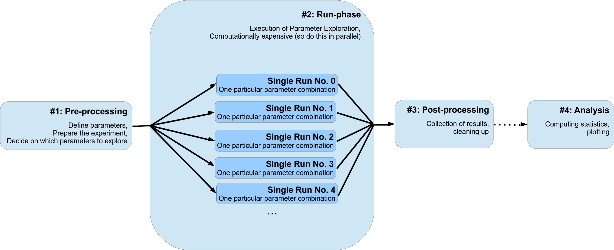
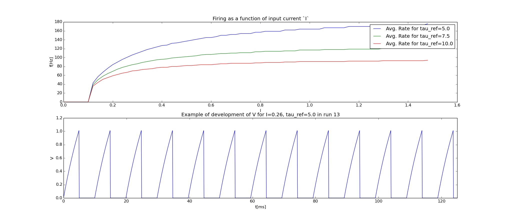

.. _tutorial:

========
Tutorial
========

-------------------------------------------
Conceptualization of a Numerical Experiment
-------------------------------------------

I will give a simple but comprehensive tutorial on *pypet* and how to use it for parameter
exploration of numerical experiments in python.

*pypet* is designed to support your numerical simulations in two ways: Allow
**a)** easy exploration of the parameter space of your simulations and **b)** easy storage of
the results.

We will assume that usually a numerical experiments consist of two to four different stages:

    1. Pre-processing
        Parameter definition,
        preparation of the experiment
    2. The *run phase* of your experiment
        Fan-out structure, usually parallel running of different parameter settings,
        gathering of individual results for each single run
    3. Post-processing (optional)
        Cleaning up of the experiment, sorting results, etc.
    4. Analysis of results (optional)
        Plotting, doing statistics etc.

The first stage can be further divided into two sub-stages.
In the beginning the definition of parameters (either directly in the source code
or by parsing a configuration file) and, next, the appropriate setup of your experiment.
This might involve creating particular python objects or pre-computing some expensive
functions etc. Moreover, here you also decide if you want to deviate from your default
set of parameters and explore the parameter space and try a bunch of different settings.
Probably you want to do a sensitivity analysis and determine the effect of changing
a critical subset of your parameters.

The second stage, the *run phase*, is the actual execution of your numerical simulation.
Here you perform the search or exploration of the parameter space. You try all
different parameter settings you have specified before for exploration and obtain the
corresponding results. Since this stage is most likely the computational expensive one, you
probably want to parallelize your simulations. I will refer to an individual simulation run
with one particular parameter combination as a **single run** of your simulation.
Since these **single runs** are different individual simulations with different parameter
settings, they are completely independent of each other. The results and outcomes of
one **single run** should not influence another. Sticking to this assumption makes the
parallelization of your experiments much easier. This doesn't mean that non-independent runs
cannot be handled by *pypet* (they can!), it rather means you **should not** do this for cleaner
and easier portable code and simulations.

Thirdly, after all individual **single runs** are completed
you might have a phase of post-processing.
This could encompass merging or collecting of results of individual single runs
and/or deconstructing some sensitive python objects, etc.

Finally, you do further analysis of the raw results of your numerical
simulation, like generating plots and meta statistics, etc.
Personally, I would strictly separate this final phase from
the previous three. Thus, using a complete different python script than for the phases before.

This conceptualization is depicted in the figure below:

*pypet* gives is you a tool to make the stages much easier to handle. *pypet*
offers a novel tree data container called :class:`~pypet.trajectory.Trajectory`
that can be used to store all parameters and results of your numerical simulations.
Moreover, *pypet* has an :class:`~pypet.environment.Environment` that
allows easy parallel exploration of the parameter space.

We will see how we can use both in our numerical experiment at the different stages.
In this tutorial we will simulate a simple neuron model, called `leaky integrate-and-fire model`_.
Our neuron model is given by a dynamical variable :math:`V` that describes the development
of the so called *membrane potential* over time. Every time this potential crosses
a particular threshold our neuron is *activated* and emits an electrical pulse. These
pules, called action potentials or spikes, are the sources of information transmission in the brain.
We will stimulate our neuron with an experimental current :math:`I` and see how this current
affects the emission of spikes. For simplicity we assume a system
without any physical units except for time in milliseconds.

We will numerically integrate the linear differential
equation:

.. math::

    \frac{dV}{dt} = -\frac{1}{\tau_V} V + I

with a non-linear reset rule :math:`V \leftarrow 0` if :math:`V \geq 1` and
an additional refractory period of :math:`\tau_{ref}`. If we detect an
action potential, i.e. :math:`V \geq 1`, we will keep the voltage :math:`V` clamped to 0
for the refractory period after the threshold crossing and freeze the differential equation.

Regarding parameter exploration, we will hold the
neuron's time constant :math:`\frac{1}{\tau_V}=10` ms fixed and explore the parameter space
by varying different input currents :math:`I` and different lengths of the refractory period
:math:`\tau_{ref}`.

During the single runs we will record the development of the variable
:math:`V` over time and count the number of threshold crossings to estimate the so called
firing rate of a neuron.
In the post processing phase we will collect these firing rates and write them into a `pandas
DataFrame`_.
Don't worry if you are not familiar with pandas_. Basically, a pandas_ DataFrame instantiates
a table. It's like a 2D numpy array, but we can index into the table by more than just integers.

Finally, during the analysis, we will plot the neuron's rate as a function of the
input current :math:`I` and the refractory period :math:`\tau_{ref}`.

The entire source code of this example can be found here: :ref:`example-13`.

-----------------
Naming Convention
-----------------

To avoid confusion with natural naming scheme and the functionality provided by the
trajectory tree - that includes all group and leaf nodes like
parameters and results - I followed the idea by PyTables_ to use prefixes:
``f_`` for functions and ``v_`` for python variables/attributes/properties.

For instance, given a *pypet* result container ``myresult``, ``myresult.v_comment`` is the object's
comment attribute and
``myresult.f_set(mydata=42)`` is the function for adding data to the result container.
Whereas ``myresult.mydata`` might refer to a data item named ``mydata`` added by the user.

If you don't like using prefixes, you can alternatively also use the properties
``vars`` and ``func`` that are supported by each tree node. For example,
``traj.f_iter_runs()`` is equivalent to ``traj.func.iter_runs()`` or
``mygroup.v_full_name`` is equivalent to ``mygroup.vars.full_name``.

The prefix and ``vars``/``func`` notation only applies to tree data objects
(group nodes and leaf nodes) but
not to other aspects of pypet. For example, the :class:`~pypet.environment.Environment`
does not rely on prefixes at all.

-----------------
#1 Pre-Processing
-----------------

Your experiment usually starts with the creation of an :class:`~pypet.environment.Environment`.
Don't worry about the huge amount of parameters you can pass to the constructor,
these are more for tweaking of your experiment and the default settings are usually
suitable.

Yet, we will shortly discuss the most important ones here.

* ``trajectory``

    Here you can either pass an already existing trajectory container or simply a string
    specifying the name of a new trajectory. In the latter case the environment will
    create a trajectory container for you.

* ``add_time``

    If ``True`` and the environment creates a new trajectory container, it will add the current time
    to the name in the format *_XXXX_XX_XX_XXhXXmXXs*.
    So for instance, if you set ``trajectory='Gigawatts_Experiment'`` and ``add_time=true``,
    your trajectory's name will be `Gigawatts_Experiment_2015_10_21_04h23m00s`.

* ``comment``

    A nice descriptive comment about what you are going to do in your numerical experiment.

* ``log_config``

    The name of a logging ``.ini`` file specifying the logging set up.
    See :ref:`more-on-logging`, or the `logging documentation`_ and how to specify
    `logging config files`_. If set to :const:`~pypet.pypetconstants.DEFAULT_LOGGING`
    (``'DEFAULT'``) the default settings are used. Simply set to `None` if you want to
    disable logging.

* ``multiproc``

    If we want to use multiprocessing. We sure do so, so we set this to ``True``.

* ``ncores``

    The number of cpu cores we want to utilize. More precisely, the number of processes we
    start at the same time to calculate the single runs. There's usually no benefit in
    setting this value higher than the actual number of cores your computer has.

* ``filename``

    We can specify the name of the resulting HDF5 file where all data will be stored.
    We don't have to give a filename per se, we can also specify a folder ``'./results/'`` and
    the new file will have the name of the trajectory.

* ``git_repository``

    If your code base is under git_ version control (it's not? Stop reading and get git_ NOW! ;-),
    you can specify the path to your root git
    folder here. If you do this, *pypet* will a) trigger a new commit if it detects changes
    in the working copy of your code and b) write the corresponding commit code into
    your trajectory so you can immediately see with which version you did your experiments.

* ``git_fail``

    If you don't want automatic commits, simply set ``git_fail=True``. Given changes in your
    code base, your program will throw a `GitDiffError` instead of making an automatic commit.
    Then, you can manually make a commit and restart your program with the committed changes.

* ``sumatra_project``

    If your experiments are recorded with sumatra_ you can specify the path to your sumatra_
    root folder here. *pypet* will automatically trigger the recording of your experiments
    if you use :func:`~pypet.environment.Environment.run`,
    :func:`~pypet.environment.Environment.resume` or
    :func:`~pypet.environment.Environment.pipeline` to start your single runs or whole experiment.
    If you use *pypet* + git_ + sumatra_ there's no doubt that you ensure
    the repeatability of your experiments!

Ok, so let's start with creating an environment:

.. code-block:: python

    from pypet import Environment
    env = Environment(trajectory='FiringRate',
                      comment='Experiment to measure the firing rate '
                            'of a leaky integrate and fire neuron. '
                            'Exploring different input currents, '
                            'as well as refractory periods',
                      add_time=False, # We don't want to add the current time to the name,
                      log_config='DEFAULT',
                      multiproc=True,
                      ncores=2, # My laptop has 2 cores ;-)
                      filename='./hdf5/', # We only pass a folder here, so the name is chosen
                      # automatically to be the same as the Trajectory
                      )

The environment provides a new trajectory container for us:

.. code-block:: python

    traj = env.trajectory

------------------------
The Trajectory Container
------------------------

A :class:`~pypet.trajectory.Trajectory` is the container for your parameters and results.
It basically instantiates a tree.

This tree has four major branches: *config* (parameters), *parameters*,
*derived_parameters* and *results*.

Parameters stored under *config* do not specify the outcome of your simulations but
only the way how the simulations are carried out. For instance, this might encompass
the number of cpu cores for multiprocessing. In fact, the environment from above has already added
the config data we specified before to the trajectory:

    >>> traj.config.ncores
    2

Parameters in the *parameters* branch are the fundamental building blocks of your simulations.
Changing a parameter
usually effects the results you obtain in the end. The set of parameters should be
complete and sufficient to characterize a simulation. Running a numerical simulation
twice with the very same parameter settings should give also the very same results.
So make sure to also add seed values of random number generators to your parameter set.

Derived parameters are specifications of your simulations that, as the name says, depend
on your original parameters but are still used to carry out your simulation.
They are somewhat too premature to be considered as final results.
We won't have any of these in the tutorial so you can ignore this branch for the moment.

Anything found under *results* is, as expected, a result of your numerical simulation.

^^^^^^^^^^^^^^^^^^^^
Adding of Parameters
^^^^^^^^^^^^^^^^^^^^

Ok, for the moment let's fill the trajectory with parameters for our simulation.

Let's fill it using the
:func:`~pypet.naturalnaming.ParameterGroup.f_add_parameter` function:

.. code-block:: python

    traj.f_add_parameter('neuron.V_init', 0.0,
                         comment='The initial condition for the '
                                    'membrane potential')
    traj.f_add_parameter('neuron.I', 0.0,
                         comment='The externally applied current.')
    traj.f_add_parameter('neuron.tau_V', 10.0,
                         comment='The membrane time constant in milliseconds')
    traj.f_add_parameter('neuron.tau_ref', 5.0,
                        comment='The refractory period in milliseconds '
                                'where the membrane potnetial '
                                'is clamped.')

    traj.f_add_parameter('simulation.duration', 1000.0,
                         comment='The duration of the experiment in '
                                'milliseconds.')
    traj.f_add_parameter('simulation.dt', 0.1,
                         comment='The step size of an Euler integration step.')

Again we can provide descriptive comments.
All these parameters will be added to the branch *parameters*.

As a side remark, if you think there's a bit too much typing involved here, you can
also make use of much shorter notations. For example, granted you imported the
:class:`~pypet.parameter.Parameter`, you could replace the last addition by:

.. code-block:: python

    traj.parameters.simulation.dt = Parameter('dt', 0.1, comment='The step size of an Euler integration step.')

Or even shorter:

.. code-block:: python

    traj.par.simulation.dt = 0.1, 'The step size of an Euler integration step.'

Note that we can *group* the parameters. For instance, we have a group ``neuron`` that contains
parameters defining our neuron model and a group ``simulation`` that defines the details of the simulation,
like the euler step size and the whole runtime.
If a group does not exist at the time of a parameter creation, *pypet* will automatically
create the groups on the fly.

There's no limit to grouping, and it can be nested:

    >>> traj.f_add_parameter('brian.hippocampus.nneurons', 99999, comment='Number of neurons in my model hippocampus')

There are analogue functions for *config* data, *results* and *derived_parameters*:

* :func:`~pypet.naturalnaming.ConfigGroup.f_add_config`
* :func:`~pypet.naturalnaming.ResultGroup.f_add_result`
* :func:`~pypet.naturalnaming.DerivedParameterGroup.f_add_derived_parameter`

If you don't want to stick to these four major branches there is the generic addition:

* :func:`~pypet.naturalnaming.NNGroupNode.f_add_leaf`

By the way, you can add particular groups directly with:

* :func:`~pypet.naturalnaming.ParameterGroup.f_add_parameter_group`
* :func:`~pypet.naturalnaming.ConfigGroup.f_add_config_group`
* :func:`~pypet.naturalnaming.ResultGroup.f_add_result_group`
* :func:`~pypet.naturalnaming.DerivedParameterGroup.f_add_derived_parameter_group`

and the generic one:

* :func:`~pypet.naturalnaming.NNGroupNode.f_add_group`

Your trajectory tree contains two types of nodes, group nodes
and leaf nodes. Group nodes can, as you have seen, contain other group or leaf nodes, whereas
leaf nodes are terminal and do not contain more groups or leaves.

The leaf nodes are abstract containers for your actual data. Basically,
there exist two sub-types of these leaves :class:`~pypet.parameter.Parameter`
containers for your config data, parameters,
and derived parameters and :class:`~pypet.parameter.Result` containers for your results.

A :class:`~pypet.parameter.Parameter` can only contain a single data item plus potentially
a **range** or list of different values describing how the parameter should be explored in
different runs.

A :class:`~pypet.parameter.Result` container can manage several results. You can think of it
as non-nested dictionary. Actual data can also be accessed via natural naming or squared
brackets (as discussed in the next section below).

For instance:

    >>> traj.f_add_result('deep.thought', answer=42, question='What do you get if you multiply six by nine?')
    >>> traj.results.deep.thought.question
    'What do you get if you multiply six by nine?'

Both leaf containers (:class:`~pypet.parameter.Parameter`, :class:`~pypet.parameter.Result`)
support a rich variety of data types. There also exist more specialized versions if the
standard ones cannot hold your data, just take
a look at :ref:`more-on-parameters`. If you are still missing some functionality for
your particular needs you can simply
implement your own leaf containers and put them into the *trajectory*.

^^^^^^^^^^^^^^
Accessing Data
^^^^^^^^^^^^^^

Data can be accessed in several ways.
You can, for instance, access data via *natural naming*:
``traj.parameters.neuron.tau_ref`` or square brackets ``traj['parameters']['neuron']['tau_ref']``
or ``traj['parameters.neuron.tau_ref']``, or ``traj['parameters','neuron','tau_ref']``,
or use the :func:`~pypet.naturalnaming.NNGroupNode.f_get` method.

As long as your tree nodes are unique, you can shortcut through the tree. If there's only
one parameter ``tau_ref``, ``traj.tau_ref`` is equivalent to ``traj.parameters.neuron.tau_ref``.

Moreover, since a :class:`~pypet.parameter.Parameter` only contains a single value (apart
from the range),
*pypet* will assume that you usually don't care about the actual container but just about
the data. Thus, ``traj.parameters.neuron.tau_ref`` will immediately return the data value
for ``tau_ref`` and not the corresponding :class:`~pypet.parameter.Parameter` container.
If you really need the container itself use :func:`~pypet.naturalnaming.NNGroupNode.f_get`.
To learn more about this concept of *fast access* of data look at :ref:`more-on-access`.

^^^^^^^^^^^^^^^^^^
Exploring the Data
^^^^^^^^^^^^^^^^^^

Next, we can tell the trajectory which parameters we want to explore. We simply need
need to pass a dictionary of lists (or other iterables) of the **same length** with
arbitrary entries to the trajectory function
:func:`~pypet.trajectory.Trajectory.f_explore`.

Every single run in the run phase will contain one setting of parameters
in the list. For instance, if our exploration dictionary looks like
``{'x':[1,2,3], 'y':[1,1,2]}`` the first run will be with parameter `x` set to 1 and `y` to 1,
the second with `x` set to 2 and `y` set to 1, and the final third one with `x=3` and `y=2`.

If you want to explore the cartesion product of two iterables not having the same length
you can use the :func:`~pypet.utils.explore.cartesian_product` builder function.
This will return a dictionary of lists of the same length and all combinations of
the parameters.

Here is our exploration, we try unitless currents :math:`I` ranging from 0 to 1.01 in steps of 0.01
for three different refractory periods :math:`\tau_{ref}`:

.. code-block:: python

    from pypet.utils.explore import cartesian_product

    explore_dict = {'neuron.I': np.arange(0, 1.01, 0.01).tolist(),
                    'neuron.tau_ref': [5.0, 7.5, 10.0]}

    explore_dict = cartesian_product(explore_dict, ('neuron.tau_ref', 'neuron.I'))
    # The second argument, the tuple, specifies the order of the cartesian product,
    # The variable on the right most side changes fastest and defines the
    # 'inner for-loop' of the cartesian product

    traj.f_explore(explore_dict)

Note that in case we explore some parameters, their default values that we passed before
via :func:`~pypet.naturalnaming.ParameterGroup.f_add_parameter` are no longer used.
If you still want to simulate these, make sure they are part of the lists in the
exploration dictionary.

----------------
#2 The Run Phase
----------------

Next, we define a job or top-level simulation run function (that
not necessarily has to be a real python function, any callable object will do the job).
This function will be called and executed with every parameter combination we specified before
with :func:`~pypet.trajectory.Trajectory.f_explore` in
the trajectory container.

In our neuron simulation we have 303 different runs of our simulation. Each run has particular index
ranging from 0 to 302 and a particular name that follows the structure `run_XXXXXXXX`
where `XXXXXXXX` is replaced with the index and some leading zeros. Thus, our run names
range from `run_00000000` to `run_00000302`.

Note that we start counting with 0, so the second run is called
`run_00000001` and has index 1!

So here is our top-level simulation or run function:

.. code-block:: python

    def run_neuron(traj):
        """Runs a simulation of a model neuron.

        :param traj:

            Container with all parameters.

        :return:

            An estimate of the firing rate of the neuron

        """

        # Extract all parameters from `traj`
        V_init = traj.par.neuron.V_init
        I = traj.par.neuron.I
        tau_V = traj.par.neuron.tau_V
        tau_ref = traj.par.neuron.tau_ref
        dt = traj.par.simulation.dt
        duration = traj.par.simulation.duration

        steps = int(duration / float(dt))
        # Create some containers for the Euler integration
        V_array = np.zeros(steps)
        V_array[0] = V_init
        spiketimes = []  # List to collect all times of action potentials

        # Do the Euler integration:
        print('Starting Euler Integration')
        for step in range(1, steps):
            if V_array[step-1] >= 1:
                # The membrane potential crossed the threshold and we mark this as
                # an action potential
                V_array[step] = 0
                spiketimes.append((step-1)*dt)
            elif spiketimes and step * dt - spiketimes[-1] <= tau_ref:
                # We are in the refractory period, so we simply clamp the voltage
                # to 0
                V_array[step] = 0
            else:
                # Euler Integration step:
                dV = -1/tau_V * V_array[step-1] + I
                V_array[step] = V_array[step-1] + dV*dt

        print('Finished Euler Integration')

        # Add the voltage trace and spike times
        traj.f_add_result('neuron.$', V=V_array, nspikes=len(spiketimes),
                      comment='Contains the development of the membrane potential over time '
                              'as well as the number of spikes.')
        # This result will be renamed to `traj.results.neuron.run_XXXXXXXX`.

        # And finally we return the estimate of the firing rate
        return len(spiketimes) / float(traj.par.simulation.duration) * 1000
        # *1000 since we have defined duration in terms of milliseconds

Our function has to accept at least one argument and this is our ``traj`` container.
During the execution of our simulation function the *trajectory* will contain just one parameter
setting out of our 303 different ones from above.
The *environment* will make sure that our function is called
with each of our parameter choices once.

For instance, if we currently execute the second run (aka `run_00000001`)
all parameters will contain their default values, except ``tau_ref`` and ``I``, they will
be set to 5.0 and 0.01, respectively.

Let's take a look at the first few instructions:

.. code-block:: python

    # Extract all parameters from `traj`
    V_init = traj.par.neuron.V_init
    I = traj.par.neuron.I
    tau_V = traj.par.neuron.tau_V
    tau_ref = traj.par.neuron.tau_ref
    dt = traj.par.simulation.dt
    duration = traj.par.simulation.duration

So here we simply extract the parameter values from ``traj``.
As said before *pypet* is smart to directly return the data value instead of
a :class:`~pypet.parameter.Parameter` container. Moreover, remember all parameters
will have their default values except ``tau_ref`` and ``I``.

Next, we create a numpy array and a python list and compute the number of steps. This is
not specific to *pypet* but simply needed for our neuron simulation:

.. code-block:: python

    steps = int(duration / float(dt))
    # Create some containers for the Euler integration
    V_array = np.zeros(steps)
    V_array[0] = V_init
    spiketimes = []  # List to collect all times of action potentials

Also the following steps have nothing to do with *pypet*, so don't worry if you not
fully understand what's going on here.
This is just the core of our neuron simulation:

.. code-block:: python

    # Do the Euler integration:
    print('Starting Euler Integration')
    for step in range(1, steps):
        if V_array[step-1] >= 1:
            # The membrane potential crossed the threshold and we mark this as
            # an action potential
            V_array[step] = 0
            spiketimes.append((step-1)*dt)
        elif spiketimes and step * dt - spiketimes[-1] <= tau_ref:
            # We are in the refractory period, so we simply clamp the voltage
            # to 0
            V_array[step] = 0
        else:
            # Euler Integration step:
            dV = -1/tau_V * V_array[step-1] + I
            V_array[step] = V_array[step-1] + dV*dt

    print('Finished Euler Integration')

This is simply the python description of the following set of equations:

.. math::

    \frac{dV}{dt} = -\frac{1}{\tau_V} V + I

and :math:`V \leftarrow 0` **if** :math:`V \geq 1`  **or** :math:`t-t_{s} \leq \tau_{ref}`
(with :math:`t` the current time and :math:`t_{s}` time of the last spike).

Ok, for now we have finished one particular run ouf our simulation. We computed the development
of the membrane potential :math:`V` over time and put it into ``V_array``.

Next, we hand over this data to our trajectory, since we want to keep it and write it
into the final HDF5 file:

.. code-block:: python

    traj.f_add_result('neuron.$', V=V_array, nspikes=len(spiketimes),
                      comment='Contains the development of the membrane potential over time '
                              'as well as the number of spikes.')

This statement looks similar to the addition of parameters we have seen before. Yet, there
are some subtle differences. As we can see, a result can contain several data items.
If we pass them via ``NAME=value``, we can later on recall them from the result with ``result.NAME``.
Secondly, there is this odd ``'$'`` character in the result's name.
Well, recall that we are currently operating in the run phase, accordingly the ``run_neuron``
function will be executed many times. Thus, we also gather the
``V_array`` data many times. We need to store this every time under a different
name in our trajectory tree. ``'$'`` is a wildcard character that is replaced by the name
of the current run. If we were in the second run, we would store everything under
``traj.results.neuron.run_00000001`` and in the third run under
``traj.results.neuron.run_00000002`` and so on and so forth.
Consequently, calling ``traj.results.neuron.run_00000001.V`` will return our membrane voltage array
of the second run.

You are not limited to place the ``'$'`` at the end, for example

.. code-block:: python

   traj.f_add_result('fundamental.wisdom.$.answer', 42, comment='The answer')

would be possible as well.

As a side remark, if you add a result or derived parameter during the run phase but
**not** use the ``'$'`` wildcard, *pypet* will add ``runs.'$'`` to the beginning of your
result's or derived parameter's name.

So executing the following statement during the run phase

.. code-block:: python

    traj.f_add_result('fundamental.wisdom.answer', 42, comment='The answer')

will yield a renaming to ``results.runs.run_XXXXXXXXX.fundamental.wisdom.answer``.
Where `run_XXXXXXXXX` is the name of the corresponding run, of course.

Moreover, it's worth noticing that you don't have to explicitly write the trajectory to disk.
Everything you add during pre-processing, post-processing (see below) is
automatically stored at
the end of the experiment. Everything you add
during the run phase under a group or leaf node called `run_XXXXXXXX` (where this is the name of the
current run, which will be automatically chosen if you use the ``'$'`` wildcard)
will be stored at the end of the particular run.

------------------
#3 Post-Processing
------------------

Each single run of our ``run_neuron`` function returned an estimate of the firing rate.
In the post processing phase we want to collect these estimates and sort them into a
table according to the value of :math:`I` and :math:`\tau_{ref}`. As an appropriate table we choose a
`pandas DataFrame`_. Again this is not *pypet* specific but pandas_ offers neat
containers for series, tables and multidimensional panel data.
The nice thing about pandas_ containers is that they except all forms of indices and not
only integer indices like python lists or numpy arrays.

So here comes our post processing function.
This function will be automatically called when all single runs are completed.
The post-processing function has to take at least two arguments.
First one is the trajectory, second one is the list of results.
This list actually contains two-dimensional tuples. First entry of the tuple is the index
of the run as an integer, and second entry is the result returned by our job-function
``run_neuron`` in the corresponding run.

.. code-block:: python

    def neuron_postproc(traj, result_list):
        """Postprocessing, sorts firing rates into a data frame.

        :param traj:

            Container for results and parameters

        :param result_list:

            List of tuples, where first entry is the run index and second is the actual
            result of the corresponding run.

        :return:
        """

        # Let's create a pandas DataFrame to sort the computed firing rate according to the
        # parameters. We could have also used a 2D numpy array.
        # But a pandas DataFrame has the advantage that we can index into directly with
        # the parameter values without translating these into integer indices.
        I_range = traj.par.neuron.f_get('I').f_get_range()
        ref_range = traj.par.neuron.f_get('tau_ref').f_get_range()

        I_index = sorted(set(I_range))
        ref_index = sorted(set(ref_range))
        rates_frame = pd.DataFrame(columns=ref_index, index=I_index)
        # This frame is basically a two dimensional table that we can index with our
        # parameters

        # Now iterate over the results. The result list is a list of tuples, with the
        # run index at first position and our result at the second
        for result_tuple in result_list:
            run_idx = result_tuple[0]
            firing_rates = result_tuple[1]
            I_val = I_range[run_idx]
            ref_val = ref_range[run_idx]
            rates_frame.loc[I_val, ref_val] = firing_rates # Put the firing rate into the
            # data frame

        # Finally we going to store our new firing rate table into the trajectory
        traj.f_add_result('summary.firing_rates', rates_frame=rates_frame,
                          comment='Contains a pandas data frame with all firing rates.')

Ok, we will go through it one by one.
At first we extract the range of parameters we used:

.. code-block:: python

    I_range = traj.par.neuron.f_get('I').f_get_range()
    ref_range = traj.par.neuron.f_get('tau_ref').f_get_range()

Note that we use :func:`pypet.naturalnaming.NNGroupNode.f_get` here since
we are interested in the parameter container not the
data value. We can directly extract the parameter range from the container
via :math:`pypet.parameter.Parameter.f_get_range`.

Next, we create a two dimensional table aka `pandas DataFrame`_ with the current as the
row indices and the refractory period as column indices.

.. code-block:: python

    I_index = sorted(set(I_range))
    ref_index = sorted(set(ref_range))
    rates_frame = pd.DataFrame(columns=ref_index, index=I_index)

Now we iterate through the result tuples and  write the
firing rates into the table according to the parameter settings in this run.
As said before, the nice thing about pandas_ is that we can use the values of
:math:`I`` and :math:`\tau_{ref}`` as indices for our table.

.. code-block:: python

    for result_tuple in result_list:
            run_idx = result_tuple[0]
            firing_rates = result_tuple[1]
            I_val = I_range[run_idx]
            ref_val = ref_range[run_idx]
            rates_frame.loc[I_val, ref_val] = firing_rates

Finally, we add the filled DataFrame to the trajectory.

.. code-block:: python

    traj.f_add_result('summary.firing_rates', rates_frame=rates_frame,
                          comment='Contains a pandas data frame with all firing rates.')

Since we are no longer in the run phase, this result will be found in
``traj.results.summary.firing_rate`` and **no** name of any single run will be added.

This was our post-processing where we simply collected all firing rates and sorted
them into a table. You can, of course, do much more in the post processing phase. You can
load all computed data and look at it.
You can even expand the trajectory to trigger a new run phase. Accordingly, you can adaptively
and iteratively search the parameter space. You may even do this on the fly while there
are still single runs being executed, see :ref:`more-about-postproc`.

------------------------------
Final Steps in the Main Script
------------------------------

Still we actually need to make the environment execute all the stuff, so this is our main
script after we generated the environment and added the parameters.
First, we add the post-processing function. Secondly, we tell the environment to
run our function ``run_neuron``. Our postprocessing function will be automatically called
after all runs have finished.

.. code-block:: python

    # Ad the postprocessing function
    env.add_postprocessing(neuron_postproc)

    # Run the experiment
    env.run(run_neuron)

Both function take additional arguments which will be automatically passed to the job and
post-processing functions.

For instance,

.. code-block:: python

    env.run(myjob, 42, 'fortytwo', test=33.3)

will additionally pass ``42, 'fortytwo'`` as positional arguments and ``test=33.3`` as the
keyword argument ``test`` to your run function. So the definition of the run function could look
like this:

.. code-block:: python

    def myjob(traj, number, text, test):
        # do something

Remember that the trajectory will always be passed as first argument.
This works analogously for the
post-processing function as well. Yet, there is the slight difference that your post-processing
function needs to accept the result list as second positional argument followed by your
positional and keyword arguments.

Finally, if you used *pypet*'s logging feature, it is usually a good idea to tell the
environment to stop logging and close all log files:

.. code-block:: python

    # Finally disable logging and close all log-files
    env.disable_logging()

-----------
#4 Analysis
-----------

The final stage of our experiment encompasses the analysis of our raw data. We won't do much
here, simply plot our firing rate table and show one example voltage trace.
All data analysis happens in a completely different script and is executed independently
of the previous three steps except that we need the data from them in form of a trajectory.

We will make use of the :ref:`more-on-auto-loading` functionality and load results
in the background as we need them. Since we don't want to do any more single runs,
we can spare us an environment and only use a trajectory container.

.. code-block:: python

    from pypet import Trajectory
    import matplotlib.pyplot as plt

    # This time we don't need an environment since we just going to look
    # at data in the trajectory
    traj = Trajectory('FiringRate', add_time=False)

    # Let's load the trajectory from the file
    # Only load the parameters, we will load the results on the fly as we need them
    traj.f_load(filename='./hdf5/FiringRate.hdf5', load_parameters=2,
                load_results=0, load_derived_parameters=0)

    # We'll simply use auto loading so all data will be loaded when needed.
    traj.v_auto_load = True

    # Here we load the data automatically on the fly
    rates_frame = traj.res.summary.firing_rates.rates_frame

    plt.figure()
    plt.subplot(2,1,1)
    #Let's iterate through the columns and plot the different firing rates :
    for tau_ref, I_col in rates_frame.iteritems():
        plt.plot(I_col.index, I_col, label='Avg. Rate for tau_ref=%s' % str(tau_ref))

    # Label the plot
    plt.xlabel('I')
    plt.ylabel('f[Hz]')
    plt.title('Firing as a function of input current `I`')
    plt.legend()

    # Also let's plot an example run, how about run 13?
    example_run = 13

    traj.v_idx = example_run # We make the trajectory behave as a single run container.
    # This short statement has two major effects:
    # a) all explored parameters are set to the value of run 13,
    # b) if there are tree nodes with names other than the current run aka `run_00000013`
    # they are simply ignored, if we use the `$` sign or the `crun` statement,
    # these are translated into `run_00000013`.

    # Get the example data
    example_I = traj.I
    example_tau_ref = traj.tau_ref
    example_V = traj.results.neuron.crun.V # Here crun stands for run_00000013

    # We need the time step...
    dt = traj.dt
    # ...to create an x-axis for the plot
    dt_array = [irun * dt for irun in range(len(example_V))]

    # And plot the development of V over time,
    # Since this is rather repetitive, we only
    # plot the first eighth of it.
    plt.subplot(2,1,2)
    plt.plot(dt_array, example_V)
    plt.xlim((0, dt*len(example_V)/8))

    # Label the axis
    plt.xlabel('t[ms]')
    plt.ylabel('V')
    plt.title('Example of development of V for I=%s, tau_ref=%s in run %d' %
              (str(example_I), str(example_tau_ref), traj.v_idx))

    # And let's take a look at it
    plt.show()

    # Finally revoke the `traj.v_idx=13` statement and set everything back to normal.
    # Since our analysis is done here, we could skip that, but it is always a good idea
    # to do that.
    traj.f_restore_default()

The outcome of your little experiment should be the following image:

Finally, I just want to make some final remarks on the analysis script.

.. code-block:: python

    traj.f_load(filename='./hdf5/FiringRate.hdf5', load_parameters=2,
                load_results=0, load_derived_parameters=0)

describes how the different subtrees of the trajectory are loaded (``load_parameters``
also includes the ``config`` branch). 0 means no data at all is loaded,
1 means only the containers are loaded but without any data and 2 means the
containers including the data are loaded. So here we load all parameters
and all config parameters with data and no results whatsoever.

Yet, since we say ``traj.v_auto_load = True`` the statement
``rates_frame = traj.res.summary.firing_rates.rates_frame`` will return our
2D table of firing rates because the data is loaded in the background while we
request it.

Furthermore,

.. code-block:: python

    traj.v_idx = example_run

is an important statement in the code.
Setting the properties ``v_idx`` or ``v_crun`` or
using the function :func:`~pypet.trajectory.Trajectory.f_set_crun` are equivalent.
These give you a powerful tool in data analysis because they make your trajectory
behave like a particular single run. Thus, all explored parameter's values will be
set to the corresponding values of one particular run.

To restore everything back to normal simply call
:func:`~pypet.trajectory.Trajectory.f_restore_default`.

This concludes our small tutorial. If you are interested in more advance concepts
look into the cookbook or check out the code snippets in the example section.
Notably, if you consider using *pypet* with an already existing project of yours, you might
want to pay attention to :ref:`example-17` and :ref:`wrap-project`.

Cheers,
    Robert

.. _leaky integrate-and-fire model: http://en.wikipedia.org/wiki/Biological_neuron_model#Leaky_integrate-and-fire

.. _logging config files: https://docs.python.org/2/library/logging.config.html#logging-config-fileformat

.. _logging documentation: https://docs.python.org/2/library/logging.html

.. _git: http://git-scm.com/

.. _sumatra: http://neuralensemble.org/sumatra/

.. _pandas DataFrame: http://pandas.pydata.org/pandas-docs/dev/generated/pandas.DataFrame.html

.. _pandas: http://pandas.pydata.org/

.. _PyTables: http://pytables.github.io/usersguide/